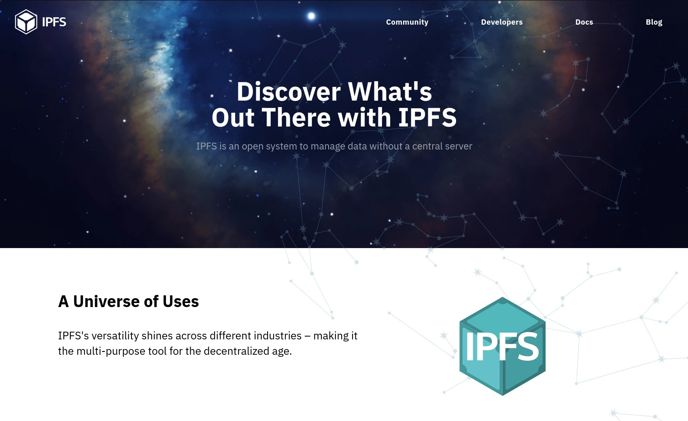
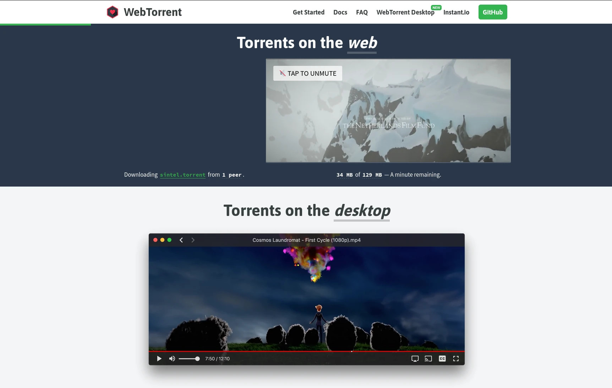

<!--

author: André Dietrich

logo:   media/logo.jpg

script: https://cdnjs.cloudflare.com/ajax/libs/PapaParse/5.4.1/papaparse.min.js

import: https://raw.githubusercontent.com/liaTemplates/ABCjs/main/README.md

import: https://raw.githubusercontent.com/liaTemplates/PyScript/main/README.md
import: https://raw.githubusercontent.com/LiaScript/CodeRunner/master/README.md

@CSV
<script run-once style="display:block" modify="false">
async function csvToMarkdownTable(csvFile) {
  const response = await fetch(csvFile);
  const text = await response.text();
  const rows = Papa.parse(text).data;
  let markdownTable = "| " + rows[0].join(" | ") + " |\n"; // Header
  markdownTable += "| " + rows[0].map(() => "---").join(" | ") + " |\n"; // Separator
  for (let i = 1; i < rows.length; i++) {
    if (rows[i].length === rows[0].length) {
      markdownTable += "| " + rows[i].join(" | ") + " |\n";
    }
  }
  send.lia("LIASCRIPT: <!-- data-type='none' --" + ">" + markdownTable);
}
csvToMarkdownTable("@0")
"LIA: wait"
</script>
@end

@WebSerial
<script>
(async function() {
  // Check if the Web Serial API is supported.
  if (!("serial" in navigator)) {
    console.error("Web Serial API is not supported in this browser.");
    return;
  }

  // Declare connection-related variables for later cleanup.
  let port = null;
  let reader = null;

  try {
    // Request and open the serial port.
    port = await navigator.serial.requestPort();
    await port.open({ baudRate: 115200 });

    // Create a TextEncoder instance.
    const encoder = new TextEncoder();
    // Function to stop any currently running code by sending Ctrl-C.
    async function stopCurrentProgram() {
      try {
        const writer = port.writable.getWriter();
        // Send Ctrl-C (ASCII 0x03) to interrupt any running code.
        await writer.write(encoder.encode("\x03"));
        // Wait briefly to allow the interrupt to be processed.
        await new Promise(resolve => setTimeout(resolve, 100));
        // Send a second Ctrl-C in case the first one was missed.
        await writer.write(encoder.encode("\x03"));
        writer.releaseLock();
      } catch (e) {
        console.error("Error sending Ctrl-C:", e);
      }
    }

    // Stop any running code before sending new code.
    await stopCurrentProgram();

    // Retrieve the entire Python code from the liascript input.
    const pythonCode = `@input(0)`;

    // Function to send code using MicroPython's paste mode.
    // In paste mode, the REPL buffers all lines until Ctrl‑D is received,
    // then it compiles and executes the entire code block at once.
    async function sendCodeInPasteMode(code) {
      const writer = port.writable.getWriter();
      // Enter paste mode (Ctrl‑E, ASCII 0x05).
      await writer.write(encoder.encode("\x05"));
      // Wait briefly for paste mode to be activated.
      await new Promise(resolve => setTimeout(resolve, 100));

      // Split the code into lines, preserving all indentation.
      const codeLines = code.split(/\r?\n/);
      for (const line of codeLines) {
        // Send each line exactly as-is, with CR+LF.
        await writer.write(encoder.encode(line + "\r\n"));
      }
      // Exit paste mode by sending Ctrl‑D (ASCII 0x04).
      await writer.write(encoder.encode("\x04"));
      writer.releaseLock();
      send.lia("LIA: terminal");
    }

    // Function that sends the code and reads output until the REPL prompt (">>>") is detected.
    // This ensures the entire block is executed before further input is allowed.
    async function sendCodeAndWaitForPrompt(code) {
      await sendCodeInPasteMode(code);
      let outputBuffer = "";
      const tempReader = port.readable.getReader();
      const decoder = new TextDecoder();
      let promptFound = false;

      while (!promptFound) {
        const { value, done } = await tempReader.read();
        if (done) break;
        if (value) {
          const text = decoder.decode(value);
          outputBuffer += text;
          console.stream(text);
          // Look for the REPL prompt (adjust if your prompt differs).
          if (outputBuffer.includes(">>>")) {
            promptFound = true;
          }
        }
      }
      await tempReader.releaseLock();
      return outputBuffer;
    }

    // Send the Python code and wait until the prompt is detected.
    await sendCodeAndWaitForPrompt(pythonCode);
    console.log("Python code executed and prompt detected.");

    // Now that execution is complete, enable terminal input.
    send.lia("LIA: terminal");

    // Start a global read loop to capture and display subsequent output.
    reader = port.readable.getReader();
    const globalDecoder = new TextDecoder();
    (async function readLoop() {
      try {
        while (true) {
          const { value, done } = await reader.read();
          if (done) {
            console.debug("Stream closed");
            send.lia("LIA: stop");
            break;
          }
          if (value) {
            console.stream(globalDecoder.decode(value));
          }
        }
      } catch (error) {
        console.error("Read error:", error);
      } finally {
        try { reader.releaseLock(); } catch (e) { /* ignore */ }
      }
    })();

    // Handler to send terminal input lines to MicroPython.
    send.handle("input", input => {
      (async function() {
        try {
          const writer = port.writable.getWriter();
          // Send the terminal input (preserving any whitespace) with CR+LF.
          await writer.write(encoder.encode(input + "\r\n"));
          writer.releaseLock();
        } catch (e) {
          console.error("Error sending input to MicroPython:", e);
        }
      })();
    });

    // Handler to clean up all connections and variables when a "stop" command is received.
    send.handle("stop", async () => {
      console.log("Cleaning up connections and stopping execution.");

      // Cancel the reader if it exists.
      if (reader) {
        try {
          await reader.cancel();
        } catch (e) {
          console.error("Error canceling reader:", e);
        }
        try { reader.releaseLock(); } catch (e) { /* ignore */ }
      }

      // Close the serial port if it's open.
      if (port) {
        try {
          await port.close();
        } catch (e) {
          console.error("Error closing port:", e);
        }
      }

      // Reset connection variables.
      port = null;
      reader = null;
      console.log("Cleanup complete.");
    });

  } catch (error) {
    console.error("Error connecting to the MicroPython device:", error);
    send.lia("LIA: stop");
  }
})();

"LIA: wait"
</script>
@end

@WebSerial2
<script>
(async function() {
  // Check if the Web Serial API is supported.
  if (!("serial" in navigator)) {
    console.error("Web Serial API is not supported in this browser.");
    return;
  }

  // Declare connection-related variables for later cleanup.
  let port = null;
  let reader = null;

  try {
    // First, check if a port was previously granted.
    const ports = await navigator.serial.getPorts();
    if (ports.length > 0) {
      port = ports[0];
      console.log("Reusing previously granted port.");
    } else {
      // If no port is available, request a new one.
      port = await navigator.serial.requestPort();
    }

    // Open the port at the typical MicroPython baud rate.
    await port.open({ baudRate: 115200 });

    // Create a TextEncoder instance.
    const encoder = new TextEncoder();

    // Function to stop any currently running code by sending Ctrl-C.
    async function stopCurrentProgram() {
      try {
        const writer = port.writable.getWriter();
        // Send Ctrl-C (ASCII 0x03) to interrupt any running code.
        await writer.write(encoder.encode("\x03"));
        // Wait briefly to allow the interrupt to be processed.
        await new Promise(resolve => setTimeout(resolve, 100));
        // Send a second Ctrl-C in case the first was missed.
        await writer.write(encoder.encode("\x03"));
        writer.releaseLock();
      } catch (e) {
        console.error("Error sending Ctrl-C:", e);
      }
    }

    // Stop any running code before sending new code.
    await stopCurrentProgram();

    // Retrieve the entire Python code from the liascript input.
    const pythonCode = `@input(0)`;

    // Function to send code using MicroPython's paste mode.
    // In paste mode, the REPL buffers all lines until Ctrl‑D is received,
    // then it compiles and executes the entire code block at once.
    async function sendCodeInPasteMode(code) {
      const writer = port.writable.getWriter();
      // Enter paste mode (Ctrl‑E, ASCII 0x05).
      await writer.write(encoder.encode("\x05"));
      // Wait briefly for paste mode to be activated.
      await new Promise(resolve => setTimeout(resolve, 100));
      
      // Split the code into lines, preserving all indentation.
      const codeLines = code.split(/\r?\n/);
      for (const line of codeLines) {
        // Send each line exactly as-is, with CR+LF.
        await writer.write(encoder.encode(line + "\r\n"));
      }
      // Exit paste mode by sending Ctrl‑D (ASCII 0x04).
      await writer.write(encoder.encode("\x04"));
      writer.releaseLock();
      send.lia("LIA: terminal");
    }

    // Function that sends the code and reads output until the REPL prompt (">>>") is detected.
    // This ensures the entire block is executed before further input is allowed.
    async function sendCodeAndWaitForPrompt(code) {
      await sendCodeInPasteMode(code);
      let outputBuffer = "";
      const tempReader = port.readable.getReader();
      const decoder = new TextDecoder();
      let promptFound = false;
      
      while (!promptFound) {
        const { value, done } = await tempReader.read();
        if (done) break;
        if (value) {
          const text = decoder.decode(value);
          outputBuffer += text;
          console.stream(text);
          // Look for the REPL prompt (adjust if your prompt differs).
          if (outputBuffer.includes(">>>")) {
            promptFound = true;
          }
        }
      }
      await tempReader.releaseLock();
      return outputBuffer;
    }

    // Send the Python code and wait until the prompt is detected.
    await sendCodeAndWaitForPrompt(pythonCode);
    console.log("Python code executed and prompt detected.");

    // Now that execution is complete, enable terminal input.
    send.lia("LIA: terminal");

    // Start a global read loop to capture and display subsequent output.
    reader = port.readable.getReader();
    const globalDecoder = new TextDecoder();
    (async function readLoop() {
      try {
        while (true) {
          const { value, done } = await reader.read();
          if (done) {
            console.debug("Stream closed");
            send.lia("LIA: stop");
            break;
          }
          if (value) {
            console.stream(globalDecoder.decode(value));
          }
        }
      } catch (error) {
        console.error("Read error:", error);
      } finally {
        try { reader.releaseLock(); } catch (e) { /* ignore */ }
      }
    })();

    // Handler to send terminal input lines to MicroPython.
    send.handle("input", input => {
      (async function() {
        try {
          const writer = port.writable.getWriter();
          // Send the terminal input (preserving any whitespace) with CR+LF.
          await writer.write(encoder.encode(input + "\r\n"));
          writer.releaseLock();
        } catch (e) {
          console.error("Error sending input to MicroPython:", e);
        }
      })();
    });

    // Handler to clean up all connections and variables when a "stop" command is received.
    send.handle("stop", async () => {
      console.log("Cleaning up connections and stopping execution.");

      // Cancel the reader if it exists.
      if (reader) {
        try {
          await reader.cancel();
        } catch (e) {
          console.error("Error canceling reader:", e);
        }
        try { reader.releaseLock(); } catch (e) { /* ignore */ }
      }

      // Close the serial port if it's open.
      if (port) {
        try {
          await port.close();
        } catch (e) {
          console.error("Error closing port:", e);
        }
      }

      // Reset connection variables.
      port = null;
      reader = null;
      console.log("Cleanup complete.");
    });

  } catch (error) {
    console.error("Error connecting to the MicroPython device:", error);
    send.lia("LIA: stop");
  }
})();

"LIA: wait"
</script>
@end

@style
@keyframes burn {
  0% {
    text-shadow: 0 0 5px #ff0, 0 0 10px #ff0, 0 0 15px #f00, 0 0 20px #f00,
      0 0 25px #f00, 0 0 30px #f00, 0 0 35px #f00;
  }
  50% {
    text-shadow: 0 0 10px #ff0, 0 0 15px #ff0, 0 0 20px #ff0, 0 0 25px #f00,
      0 0 30px #f00, 0 0 35px #f00, 0 0 40px #f00;
  }
  100% {
    text-shadow: 0 0 5px #ff0, 0 0 10px #ff0, 0 0 15px #f00, 0 0 20px #f00,
      0 0 25px #f00, 0 0 30px #f00, 0 0 35px #f00;
  }
}

.burning-text {
  font-weight: bold;
  color: #fff;
  animation: burn 1.5s infinite alternate;
}
@end

-->

# Expert-Meeting-on-AI-and-TVET-2025


## Agenda

## LiaScript


      {{1}}
<section>

#### Lack of technical skills

    --{{1}}--
You can be an expert of Arts, Medicine, or History, but you might not be a developer. This is a significant issue, as most Open Educational Resources are created by teachers, professors, or researchers who may not be familiar with the technical aspects of digital content creation. If we are honest, the medium has evolved — from stone carvings and clay tablets to paper and writing, books and printing, and now computers and __PDFs__ — but the representation has remained largely the same. Despite the vast capabilities of computers, such as enabling speech, immersive 3D experiences, and interactive content, many OERs still do not fully leverage these possibilities.


</section>  

      {{2}}
<section>

#### Separation by Tools, Platforms, and Formats

    --{{2}}--
There are numerous platforms, tools, and formats available for creating digital content. However, each platform creates its own isolated ecosystem with unique capabilities and limitations. Most of these solutions do not support multiple authors or versioning, which hinders collaborative content creation. Utilizing version control systems and platforms like GitHub or GitLab, which offer open review systems, discussion forums, wikis, and more, could address the majority of challenges we face in the creation of OER.


</section>

      {{3}}
<section>

#### OER has _No Language & No Collaboration_

    --{{3}}--
This brings us to the elephant in the room. In the open-source world, communities typically gather around programming languages, libraries, or frameworks. However, in the OER world, there is no equivalent creators mostly work on their own. Furthermore, most OER authoring tools offer a word processor-like environment, requiring users to memorize various point-and-click sequences. If there is no dedicated button, then a feature becomes inaccessible. This limitation significantly restricts the creativity and flexibility of content creators.


</section>


### History

!?[Industrial eLab Magdeburg](https://www.youtube.com/watch?v=bICfKRyKTwE)


### Hello World

    --{{0}}--
!?[](media/liascript_0.mp4)
Hello, my name is LiaScript, I am a Markdown-based language that has been specially developed to create educational materials.
The advantage of Markdown is that it is already widely used, easy to write and read, and supported by many platforms.
The biggest drawback, however, is that it is @burn(static as hell) and offers no interactivity.

     {{1-2}}
<section>

    --{{1}}--
!?[](media/liascript_1.mp4)
So my creators set out to rethink Markdown from the ground up...

?[Giorgio Moroder](https://music.youtube.com/watch?v=zhl-Cs1-sG4&si=fwB6LT2I0rQ0_CGE&start=301&end=312&autoplay=1)<!-- style="border-radius: 10px; border: none" -->

> <marquee>... Once you free your mind about a concept of Harmony and of music being "correct" you can do whatever you want ...</marquee>
>
> -- Giorgio Moroder (inventor of disco music)

</section>

    --{{2}}--
!?[](media/liascript_2.mp4)
Actually, tables in Markdown are simple to create and, as mentioned, are quite @burn(static).
However, a table can also represent a dataset that strives for its ideal visualization.

      {{2}}
| Animal                  | Weight in kg | Lifespan (years) | Mitogen |
| ----------------------- | -----------: | ---------------: | ------: |
| Mouse                   |      0.028 |               02 |      95 |
| Flying Squirrel         |      0.085 |               15 |      50 |
| Brown Bat               |      0.020 |               30 |      10 |
| Sheep                   |         90 |               12 |      95 |
| Human                   |         68 |               70 |      10 |

    --{{3}}--
!?[](media/liascript_3.mp4)
Another tabular structure can produce a different visualization that can be fine-tuned by the creator.
In total, I support 10 different types of visualizations.

      {{3}}
<!--
data-type="heatmap"
data-title="Seattle Average Temperature in Fahrenheit"
data-show
-->
| Seattle |  Jan |  Feb |  Mar |  Apr |  May |  Jun |  Jul |  Aug |  Sep |  Oct |  Nov |  Dec |
| -------:| ----:| ----:| ----:| ----:| ----:| ----:| ----:| ----:| ----:| ----:| ----:| ----:|
|       0 | 40.7 | 41.5 | 43.6 | 46.6 | 51.4 | 56.0 | 60.5 | 61.2 | 57.0 | 50.1 | 44.1 | 39.6 |
|       2 | 40.2 | 40.7 | 42.7 | 45.3 | 50.0 | 54.4 | 58.5 | 59.2 | 55.4 | 49.2 | 43.5 | 39.3 |
|       4 | 39.7 | 40.0 | 41.9 | 44.4 | 48.9 | 53.2 | 57.0 | 57.7 | 54.2 | 48.6 | 43.1 | 38.9 |
|       6 | 39.6 | 39.5 | 41.3 | 44.2 | 49.5 | 54.2 | 57.8 | 57.4 | 53.6 | 48.2 | 42.8 | 38.7 |
|       8 | 39.6 | 39.9 | 42.9 | 47.1 | 52.7 | 57.3 | 61.3 | 61.1 | 56.7 | 49.5 | 43.1 | 38.7 |
|      10 | 41.3 | 42.7 | 46.4 | 50.7 | 56.4 | 60.9 | 65.2 | 65.4 | 60.9 | 52.8 | 45.5 | 40.4 |
|      12 | 43.8 | 46.0 | 49.5 | 53.8 | 59.6 | 64.3 | 69.4 | 69.8 | 65.1 | 56.0 | 47.8 | 42.6 |
|      14 | 45.1 | 47.7 | 51.3 | 55.9 | 61.9 | 66.9 | 72.6 | 73.2 | 67.7 | 57.8 | 48.8 | 43.6 |
|      16 | 44.5 | 47.5 | 51.4 | 55.9 | 62.3 | 67.5 | 73.9 | 74.3 | 68.2 | 57.4 | 47.8 | 42.6 |
|      18 | 42.6 | 44.7 | 48.7 | 53.8 | 60.3 | 65.9 | 72.3 | 72.2 | 64.6 | 53.9 | 46.0 | 41.2 |
|      20 | 42.0 | 43.3 | 46.4 | 50.2 | 56.0 | 61.4 | 66.9 | 66.6 | 60.7 | 52.3 | 45.2 | 40.7 |
|      22 | 41.4 | 42.5 | 45.0 | 48.3 | 53.5 | 58.2 | 63.2 | 63.5 | 58.7 | 51.1 | 44.5 | 40.1 |

    --{{4}}--
!?[](media/liascript_4.mp4)
What Markdown has always lacked was the embedding of multimedia content ...

    --{{5}}--
!?[](media/liascript_5.mp4)
I support audio content ...

     {{5-6}}
?[a horse](https://www.w3schools.com/html/horse.mp3 "hear a horse")

    --{{6}}--
!?[](media/liascript_6.mp4)
I can handle video as well, and of course, I work on feature phones even if they are offline.

     {{6-7}}
!?[LiaScript on Nokia](https://www.youtube.com/watch?v=U_UW69w0uHE)

    --{{7}}--
!?[](media/liascript_7.mp4)
I can also try to embed other types of content that do not fall into either of the two categories

      {{7}}
??[Esther’s scroll in a cover](https://sketchfab.com/3d-models/esthers-scroll-in-a-cover-21a13eba33cb4343bab56f0c0f982876 "Historical Museum of the City of Kraków")

    --{{8}}--
!?[](media/liascript_8.mp4)
And much, much more... We will soon show you how everything works.

      {{8}}
```abc
X: 1
M: 4/4
L: 1/8
K: Emin
|:D2|"Em"EBBA B2 EB|~B2 AB dBAG|"D"FDAD BDAD|FDAD dAFD|
"Em"EBBA B2 EB|B2 AB defg|"D"afe^c dBAF|"Em"DEFD E2:|
```
@ABCJS.eval

    --{{9}}--
!?[](media/liascript_9.mp4)
You might have noticed that this document is being used like a PowerPoint presentation.
However, our intention was to utilize LiaScript in various contexts.
With LiaScript, you can create presentations, enable self-study through browser-based text-to-speech output, or read the content as a simple yet interactive textbook, without animations.

### Decentralized Sharing

    --{{0}}--
You might be wondering what toolchain, compiler, or setup is required to create such documents. The answer is simple: none. Everything happens within the browser.
LiaScript is a Progressive Web App that can fetch content from various locations and through different protocols. The only requirement is a link to your document, which is attached as a URL parameter. You can share this link with your colleagues or clients, allowing them to directly access your content without the need for login, registration, or installation.

<!-- style="border: 1px solid black;
border-radius: 10px;
display: inline;
box-shadow: inset 0 4px 4px rgba(0, 0, 0, 0.1);
padding: 15px;
line-height: 60px;
font-size: 20px;" -->
https://liascript.github.io/course/?https://raw.githubusercontent.com/LiaPlayground/Expert-Meeting-on-AI-and-TVET-2025/main/README.md

    --{{1}}--
However, registering on GitHub or hosting content on your own server can be challenging for content creators. To address this, we have integrated various web technologies that enable sharing without the need for a server at all. You can easily use these technologies in your projects as well.

      {{2}}
<article>

### Interplanetary File System (IPFS)

    --{{2}}--
As a web developer, you should keep an eye on the Interplanetary File System (IPFS). IPFS is a protocol and network designed to create a content-addressable, peer-to-peer method of storing and sharing content in a distributed file system. It even enables the creation of distributed applications.



    --{{3}}--
I won't go into further detail, but to our knowledge, IPFS is supported by browsers like Brave, Opera, and Aggregore.

      {{3}}
* __ Brave: https://brave.com __
* __ Opera: https://www.opera.com __
* __ Agregore: https://agregore.mauve.moe __

      {{4}}
  - Hypercore: https://hypercore-protocol.org
  - BitTorrent: https://en.wikipedia.org/wiki/BitTorrent
  - Gemini: https://gemini.circumlunar.space
  - IPFS: https://ipfs.tech

    --{{4}}--
Aggregore is particularly noteworthy for its support of various protocols, including Hypercore, BitTorrent, and Gemini, next to IPFS.

</article>


       {{5}}
<article>

### Onion-Share

    --{{5}}--
If you are seeking a more secure and anonymously method to share your content, you might want to consider OnionShare. OnionShare is an open-source tool that allows you to securely and anonymously share files of any size. It works by starting a web server directly on your computer and making it accessible through an unguessable Tor web address. Thus LiaScript content can also be shared as an onion-URL via the Tor network.


https://onionshare.org

    --{{6}}--
We have identified OnionShare as a valuable tool for delivering educational content to regions where internet access is restricted or monitored. This is particularly important in areas where education is prohibited for girls, women, minorities, or other marginalized groups. By using OnionShare, educators can bypass censorship and surveillance, providing crucial learning materials to those who need them most.

      {{6}}


      {{7}}
<section>

    --{{7}}--
For more information checkout out the following resources:

HowTo at: https://liascript.github.io/blog/sharing-via-tor-and-onion-share/

!?[Sharing LiaScript via Tor](https://www.youtube.com/watch?v=-y7I3bIeB_I&start=621 "Tutorial on sharing LiaScript courses via the Tor-Network with OnionShare")

</section>

</article>

      {{8}}
<article>

### WebTorrent

    --{{8}}--
Last but not least, WebTorrent is a streaming torrent client for both web browsers and desktop applications. Written entirely in JavaScript, WebTorrent uses WebRTC for true peer-to-peer transport. No browser plugin, extension, or installation is required.



    --{{9}}--
If you take a look at their documentation, it is quite straightforward. Within a few minutes, you can create an app that shares files via WebTorrent.

      {{9}}
https://webtorrent.io/docs

    --{{10}}--
You can try this out on [instant.io](https://instant.io); simply drag and drop a file and share the link or copy the magnet-URI to LiaScript. Once the content is loaded by LiaScript, every user also becomes a seeder of the content. This ensures that the content remains available even if the original creator is offline.

      {{10}}
https://instant.io

</article>

## Tutorial

<!-- style="width: 100%" -->

### One Document multiple Representations

                  --{{0}}--
Hi, I am a Markdown document that can be presented in
textbook mode, as slides, or as an interactive
presentation. Change the presentation mode an check out
what happens.

                  --{{1}}--
Any Markdown block can be prefixed with two braces that
contain a number to define when this block should appear in
the presentation.

                    {{1}}
* This list will be visible at step 1
* and will not be removed

                  --{{2}}--
In contrast the following table will only be visible at
step 2.

                   {{2-3}}
| Animal          |	weight in kg | Lifespan years |
|-----------------|-------------:|---------------:|
| Mouse           |	       0.028 |             02 |
| Sheep           |	          90 |             12 |
| Human           |	          68 |             70 |


                 --{{3}}--
As you might expect, I am a comment for animation step 3.
I will be visible in textbook mode or speak out loud in the
other modes. Try out to translate the document into another
language and checkout what happens.

                   {{3}}
``` markdown
                 --{{1}}--
Comments in LiaScript are prefixed with two braces that is
surrounded by two dashes. It shall contain some useful
information about the animation step. 
```
                  {{3}}
> __To disable the google translation you have to reload this site.__

### Embeddings

??[falstad: Circuit Simulator](https://www.falstad.com/circuit/circuitjs.html?ctz=CQAgjCAMB0l3BWcMBMcUHYMGZIA4UA2ATmIxAUgpABZsKBTAWjDACgAncDQkPK7Hhp8qVMJDYBnEIOH9aNPCKjgQAMwCGAG0kM2Ad2695YHjIQoobAMYyh5y6d7YLtKLHhgkCaMWwkwPCwEDDwvFEsWUTYtOzkBexdLMRAmGDhiQhoETJRcDDBsGkgEYQkANwUlJKrlUVoqJHqYBE44h1qasTg2AHs3LJVi0hA0dxKVS2FsPpkQQaph4lHRWCQIS3oZ-qoFhpGYQhQmtdGzgTZBOYAxCFX4ODuPSHEIFhAAYQ0ABw1rAEsAC4aAB21j0V2EtxU6QgYFgbwgAEkQQATACu1mBYIhSio0JSr1SEAASgxJP9JNjwWwABaqaZsIA)


#### The Browser is the new OS
<!--
persistent: true
-->

> “Any application that can be written in JavaScript, will eventually be written in JavaScript.”
>
> -- Atwood's Law

    {{1}}
??[linux](https://bellard.org/jslinux/vm.html?url=alpine-x86.cfg&mem=192)<!--
style="height: 680px; width: 100%; border: none"
-->


### Any Questions


## Extensions

Algebrite

## Programming Extensions

[CSV](https://raw.githubusercontent.com/datasciencedojo/datasets/master/titanic.csv)

### Python with PyScript
<!--
persistent: true
-->

> Source: https://github/LiaTemplates/PyScript
>
> `import: https://raw.githubusercontent.com/liaTemplates/PyScript/main/README.md`

``` python @PyScript.repl
import pyodide.http
import pandas as pd
from io import StringIO

async def fetch_data(url):
    response = await pyodide.http.pyfetch(url)
    csv_data = await response.string()
    df = pd.read_csv(StringIO(csv_data))
    return df

url = "https://raw.githubusercontent.com/datasciencedojo/datasets/master/titanic.csv"
Titanic = await fetch_data(url)

# Display the first few rows of the dataset
Titanic
```

---


```python @PyScript.repl
import matplotlib.pyplot as plt

# Calculate the absolute frequency of survivors and non-survivors
absolute_counts = Titanic.groupby(["Pclass", "Sex"])["Survived"].value_counts().unstack()

# Visualize the absolute frequencies
absolute_counts.plot(kind="bar", stacked=True, figsize=(10,6), edgecolor="black")

plt.title("Absolute frequency of survivors by passenger class and sex")
plt.xlabel("Passenger class and sex")
plt.ylabel("Number of passengers")
plt.xticks(rotation=0)
plt.legend(["Did not survive", "Survived"], title="Status")
plt.grid(axis="y", linestyle="--", alpha=0.7)
plt.show()
plt
```

### R - Women and Children First?

> Code Runner with lots of Programming languages: https://github.com/LiaScript/CodeRunner
>
> `import: https://raw.githubusercontent.com/LiaScript/CodeRunner/master/README.md`

``` r
library(ggplot2)
library(dplyr)

# Read CSV file
df <- read.csv("https://raw.githubusercontent.com/datasciencedojo/datasets/master/titanic.csv")

# Clean up Age (remove NA values)
df <- df %>% filter(!is.na(Age))

# Survival Rate based on sex and age (including men)
women_children_men <- df %>% 
  mutate(Category = case_when(
    Sex == "female" & Age < 18 ~ "Female Child",
    Sex == "female" & Age >= 18 ~ "Female Adult",
    Sex == "male" & Age < 18 ~ "Male Child",
    Sex == "male" & Age >= 18 ~ "Male Adult"
  )) %>%
  group_by(Category) %>% 
  summarise(SurvivalRate = mean(Survived), .groups = 'drop')

# Save the plot as a PNG file
png("women_children_men_survival.png", width = 800, height = 400)

ggplot(women_children_men, aes(x = Category, y = SurvivalRate, fill = Category)) +
  geom_bar(stat = "identity", position = "dodge") +
  ggtitle("Survival Rate of (women, men, and children) ") +
  xlab("Category") +
  ylab("Survival Rate") +
  scale_fill_manual(values = c("blue", "red", "green", "purple"), name = "Category") +
  theme_minimal()

dev.off()
```
@LIA.r

---

``` r
library(ggplot2)
library(dplyr)

# CSV-File
df <- read.csv("https://raw.githubusercontent.com/datasciencedojo/datasets/master/titanic.csv")

# Clean up Age (remove NA values)
df <- df %>% filter(!is.na(Age))

# PNG-File for the density plot
png("density_plot_survival.png", width = 800, height = 400)

ggplot(df, aes(x = Age, fill = as.factor(Survived))) +
  geom_density(alpha = 0.5) +
  # translate to english
  ggtitle("Density Distribution of Age among Survivors and Non-Survivors") + +
  xlab("Age") +
  ylab("Density") +
  scale_fill_manual(values = c("red", "blue"), name = "Survived", labels = c("No", "Yes")) +
  theme_minimal()

dev.off()
```
@LIA.r

### More Examples


### WebSerial & MicroPython
<!--
persistent: true
-->

<video autoplay="false" id="videoElement" style="display: none; width: 100%; padding: 5px"></video>

<script input="submit" default="Open Camera">
const video = document.querySelector("#videoElement")

if (video.srcObject === null) {
    if (navigator.mediaDevices.getUserMedia) {
        navigator.mediaDevices.getUserMedia({ video: true })
            .then(function (stream) {
                video.srcObject = stream
                video.style.display = "block"
                send.lia("Close Camera")
            })
            .catch(function (error) {
                console.log("Something went wrong!")
                send.lia("Camera Problem")
            });

        send.output("Waiting for Camera")
        "LIA: wait"
    } else {
        "No Camera connected"
    }
} else {
    const tracks = video.srcObject.getTracks()
    // Stop all tracks
    tracks.forEach(track => track.stop())
    video.style.display = "none"
    video.srcObject = null
    "Open Camera"
}
</script>

``` python
from arduino_alvik import ArduinoAlvik
from time import sleep_ms

# These two lines initialise the Arduino Alvik
alvik = ArduinoAlvik()
alvik.begin()
```
@WebSerial


``` python
# Make the two LEDs off initially
alvik.left_led.set_color(0, 0, 0)
alvik.right_led.set_color(0, 0, 0)

# Blink the two LEDs continuously
while True:
  alvik.left_led.set_color(1, 0, 0) # Left RGB LED set to Red Color
  alvik.right_led.set_color(1, 0, 0) # Right RGB LED set to Red Color
  sleep_ms(500) 

  alvik.left_led.set_color(0, 0, 0)
  alvik.right_led.set_color(0, 0, 0)
  sleep_ms(500)
```


## WebSerial

``` python
import time

# Infinite loop: prints a message every second.
while True:
    print("Hello from MicroPython!")
    time.sleep(1)
```
<script>
(async function() {
  // Check if the Web Serial API is supported.
  if (!("serial" in navigator)) {
    console.error("Web Serial API is not supported in this browser.");
    return;
  }
  
  // Declare connection-related variables for later cleanup.
  let port = null;
  let reader = null;
  
  try {
    // Request and open the serial port.
    port = await navigator.serial.requestPort();
    await port.open({ baudRate: 115200 });
    
    // Create a TextEncoder instance.
    const encoder = new TextEncoder();
    // Function to stop any currently running code by sending Ctrl-C.
    async function stopCurrentProgram() {
      try {
        const writer = port.writable.getWriter();
        // Send Ctrl-C (ASCII 0x03) to interrupt any running code.
        await writer.write(encoder.encode("\x03"));
        // Wait briefly to allow the interrupt to be processed.
        await new Promise(resolve => setTimeout(resolve, 100));
        // Send a second Ctrl-C in case the first one was missed.
        await writer.write(encoder.encode("\x03"));
        writer.releaseLock();
      } catch (e) {
        console.error("Error sending Ctrl-C:", e);
      }
    }
    
    // Stop any running code before sending new code.
    await stopCurrentProgram();
    
    // Retrieve the entire Python code from the liascript input.
    const pythonCode = `@input(0)`;
    
    // Function to send code using MicroPython's paste mode.
    // In paste mode, the REPL buffers all lines until Ctrl‑D is received,
    // then it compiles and executes the entire code block at once.
    async function sendCodeInPasteMode(code) {
      const writer = port.writable.getWriter();
      // Enter paste mode (Ctrl‑E, ASCII 0x05).
      await writer.write(encoder.encode("\x05"));
      // Wait briefly for paste mode to be activated.
      await new Promise(resolve => setTimeout(resolve, 100));
      
      // Split the code into lines, preserving all indentation.
      const codeLines = code.split(/\r?\n/);
      for (const line of codeLines) {
        // Send each line exactly as-is, with CR+LF.
        await writer.write(encoder.encode(line + "\r\n"));
      }
      // Exit paste mode by sending Ctrl‑D (ASCII 0x04).
      await writer.write(encoder.encode("\x04"));
      writer.releaseLock();
      send.lia("LIA: terminal");
    }
    
    // Function that sends the code and reads output until the REPL prompt (">>>") is detected.
    // This ensures the entire block is executed before further input is allowed.
    async function sendCodeAndWaitForPrompt(code) {
      await sendCodeInPasteMode(code);
      let outputBuffer = "";
      const tempReader = port.readable.getReader();
      const decoder = new TextDecoder();
      let promptFound = false;
      
      while (!promptFound) {
        const { value, done } = await tempReader.read();
        if (done) break;
        if (value) {
          const text = decoder.decode(value);
          outputBuffer += text;
          console.stream(text);
          // Look for the REPL prompt (adjust if your prompt differs).
          if (outputBuffer.includes(">>>")) {
            promptFound = true;
          }
        }
      }
      await tempReader.releaseLock();
      return outputBuffer;
    }
    
    // Send the Python code and wait until the prompt is detected.
    await sendCodeAndWaitForPrompt(pythonCode);
    console.log("Python code executed and prompt detected.");
    
    // Now that execution is complete, enable terminal input.
    send.lia("LIA: terminal");
    
    // Start a global read loop to capture and display subsequent output.
    reader = port.readable.getReader();
    const globalDecoder = new TextDecoder();
    (async function readLoop() {
      try {
        while (true) {
          const { value, done } = await reader.read();
          if (done) {
            console.debug("Stream closed");
            send.lia("LIA: stop");
            break;
          }
          if (value) {
            console.stream(globalDecoder.decode(value));
          }
        }
      } catch (error) {
        console.error("Read error:", error);
      } finally {
        try { reader.releaseLock(); } catch (e) { /* ignore */ }
      }
    })();
    
    // Handler to send terminal input lines to MicroPython.
    send.handle("input", input => {
      (async function() {
        try {
          const writer = port.writable.getWriter();
          // Send the terminal input (preserving any whitespace) with CR+LF.
          await writer.write(encoder.encode(input + "\r\n"));
          writer.releaseLock();
        } catch (e) {
          console.error("Error sending input to MicroPython:", e);
        }
      })();
    });
    
    // Handler to clean up all connections and variables when a "stop" command is received.
    send.handle("stop", async () => {
      console.log("Cleaning up connections and stopping execution.");
      
      // Cancel the reader if it exists.
      if (reader) {
        try {
          await reader.cancel();
        } catch (e) {
          console.error("Error canceling reader:", e);
        }
        try { reader.releaseLock(); } catch (e) { /* ignore */ }
      }
      
      // Close the serial port if it's open.
      if (port) {
        try {
          await port.close();
        } catch (e) {
          console.error("Error closing port:", e);
        }
      }
      
      // Reset connection variables.
      port = null;
      reader = null;
      console.log("Cleanup complete.");
    });
    
  } catch (error) {
    console.error("Error connecting to the MicroPython device:", error);
    send.lia("LIA: stop");
  }
})();

"LIA: wait"
</script>


## WebSerial 2

``` python
import time

# Infinite loop: prints a message every second.
while True:
    print("Hello from MicroPython!")
    time.sleep(1)
```
<script>
(async function() {
  // Check if the Web Serial API is supported.
  if (!("serial" in navigator)) {
    console.error("Web Serial API is not supported in this browser.");
    return;
  }
  
  // Declare these variables with let so they can be reassigned during cleanup.
  let port = null;
  let reader = null;
  
  try {
    // Request a serial port from the user.
    port = await navigator.serial.requestPort();
    // Open the port at a typical MicroPython baud rate.
    await port.open({ baudRate: 115200 });
    
    // Create a TextEncoder instance.
    const encoder = new TextEncoder();
    
    // Function to stop any currently running code by sending Ctrl-C.
    async function stopCurrentProgram() {
      try {
        const writer = port.writable.getWriter();
        // Send Ctrl-C (ASCII 0x03) to interrupt any running code.
        await writer.write(encoder.encode("\x03"));
        // Wait briefly to allow the interrupt to be processed.
        await new Promise(resolve => setTimeout(resolve, 100));
        // Send a second Ctrl-C in case the first one was missed.
        await writer.write(encoder.encode("\x03"));
        writer.releaseLock();
      } catch (e) {
        console.error("Error sending Ctrl-C:", e);
      }
    }
    
    // Stop any running code before sending new code.
    await stopCurrentProgram();
    
    // Retrieve the Python code from the liascript input.
    const pythonCode = `@input(0)`;
    
    // Function to send code using MicroPython's paste mode.
    async function sendCodeInPasteMode(code) {
      const writer = port.writable.getWriter();
      // Enter paste mode by sending Ctrl-E (0x05).
      await writer.write(encoder.encode("\x05"));
      // Wait briefly for paste mode to be activated.
      await new Promise(resolve => setTimeout(resolve, 100));
      
      // Split the code preserving all whitespace (supports both \n and \r\n).
      const codeLines = code.split(/\r?\n/);
      for (const line of codeLines) {
        // Send each line exactly as-is with CR+LF.
        await writer.write(encoder.encode(line + "\r\n"));
      }
      // End paste mode by sending Ctrl-D (0x04).
      await writer.write(encoder.encode("\x04"));
      writer.releaseLock();
    }
    
    // Send the new Python code in paste mode.
    await sendCodeInPasteMode(pythonCode);
    
    console.log("New Python code sent to the MicroPython device in paste mode.");
    send.lia("LIA: terminal");
    
    // Set up a reader to capture stdout from the MicroPython device.
    reader = port.readable.getReader();
    const decoder = new TextDecoder();
    
    (async function readLoop() {
      try {
        while (true) {
          const { value, done } = await reader.read();
          if (done) {
            console.debug("Stream closed");
            send.lia("LIA: stop");
            break;
          }
          if (value) {
            console.stream(decoder.decode(value));
          }
        }
      } catch (error) {
        console.error("Read error:", error);
      } finally {
        reader.releaseLock();
      }
    })();
    
    // Add a method to handle terminal input lines to be sent to MicroPython.
    send.handle("input", input => {
      (async function() {
        try {
          const writer = port.writable.getWriter();
          // Send the terminal input (preserving any leading whitespace) with CR+LF.
          await writer.write(encoder.encode(input + "\r\n"));
          writer.releaseLock();
        } catch (e) {
          console.error("Error sending input to MicroPython:", e);
        }
      })();
    });
    
    // Add a method to handle "stop" commands and clean up connections.
    send.handle("stop", async () => {
      console.log("Cleaning up connections and stopping execution.");
      
      try {
        // Interrupt any running code.
        const writer = port.writable.getWriter();
        await writer.write(encoder.encode("\x03"));
        writer.releaseLock();
      } catch (e) {
        console.error("Error sending interrupt command:", e);
      }
      
      // Cancel the reader if it exists.
      if (reader) {
        try {
          await reader.cancel();
          reader.releaseLock();
        } catch (e) {
          console.error("Error canceling reader:", e);
        }
      }
      
      // Close the serial port if it is open.
      try {
        await port.close();
      } catch (e) {
        console.error("Error closing port:", e);
      }
      
      // Reset variables.
      port = null;
      reader = null;
      console.log("Cleanup complete.");
    });
    
  } catch (error) {
    console.error("Error connecting to the MicroPython device:", error);
    send.lia("LIA: stop");
  }
})();

"LIA: wait"
</script>
